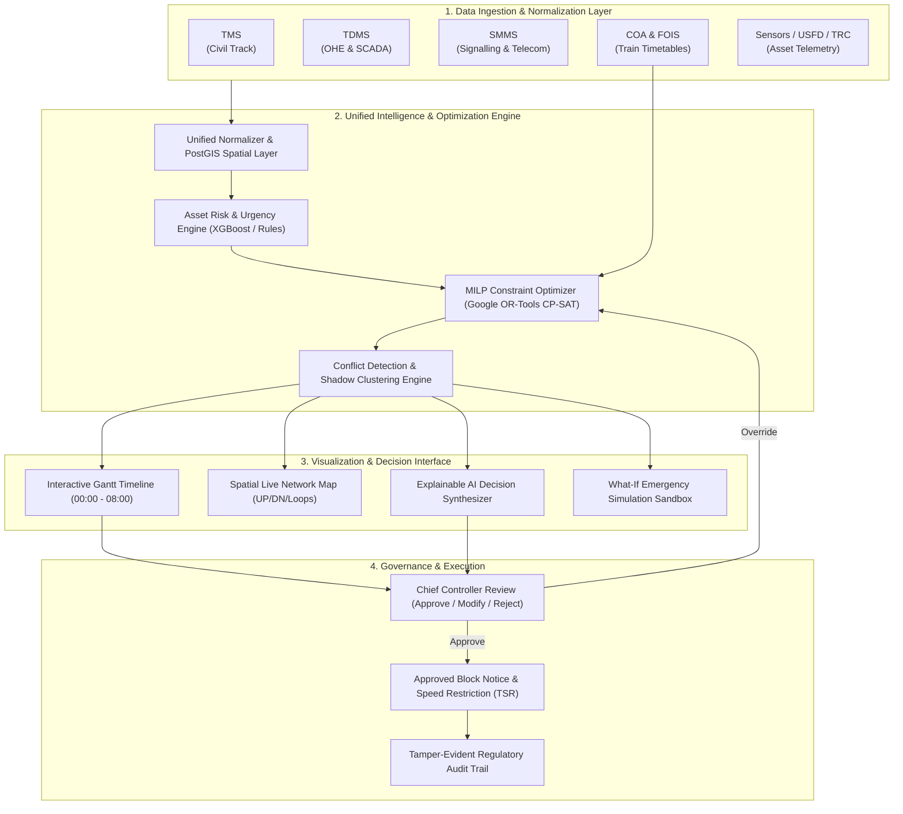

<div align="center">

# JUNCTION
### **AI-Powered Automatic Block Planning to Maximize Asset Availability for Train Operations on Indian Railways**

[](https://sih.gov.in/)
[](https://sih.gov.in/)
[](https://indianrailways.gov.in/)
[](https://sihjunction.vercel.app)
[](https://github.com/samyakmisal/junction)

<br />

> *"One system that sees the whole railway, not just one department's slice of it."*

[Live Prototype](https://sihjunction.vercel.app) • [Solution Overview](#the-problem--our-solution) • [System Architecture](#system-architecture) • [Technical Stack](#technical-stack) • [11-Step Workflow](#end-to-end-conceptual-demo-flow) • [Team](#team-junction)

---

</div>

## Executive Summary

| Attribute | Details |
| :--- | :--- |
| **Problem Statement ID** | **SIH26027** |
| **Problem Statement Title** | AI-Powered Automatic Block Planning to Maximize Asset Availability for Train Operations on Indian Railways |
| **Theme & Category** | Transportation & Logistics \| Software |
| **Organization** | Ministry of Railways, Government of India |
| **Live Prototype URL** | [https://sihjunction.vercel.app](https://sihjunction.vercel.app) |
| **Official Repository** | [https://github.com/samyakmisal/junction.git](https://github.com/samyakmisal/junction.git) |

---

## The Problem & Our Solution

### The Problem in Indian Railways Today
Fixed-infrastructure maintenance across Indian Railways is currently planned in **departmental silos**:
* **Civil Engineering (Track)** logs track geometry, switch, and rail defects in **TMS** (*Track Management System*).
* **Electrical (TRD / OHE)** logs 25kV catenary wear and transformer health in **TDMS** (*Traction Distribution Management System*).
* **Signalling & Telecom (S&T)** manages point machines and axle counters in **SMMS** (*Signalling Maintenance & Management System*).
* **Train Operations** manages dynamic train paths and section capacity in **COA** (*Control Office Application*).

```
  [TMS (Track)]        [TDMS (OHE)]        [SMMS (S&T)]        [COA (Timetables)]
         │                   │                   │                    │
         └───► Fragmented Block Requests (BDMS / Phone / Paper) ◄─────┘
                             │
                             ▼
  [!] Repeated Line Closures (Track blocked for Track work today, OHE work tomorrow)
  [!] Severe Passenger Train Delays (Vande Bharat / Rajdhani detained behind maintenance)
  [!] Suboptimal Crew & Heavy Machinery (Duomatic / BCM) Utilization
```

---

### The Junction Solution
**JUNCTION** unifies maintenance data, sensor condition streams, and train timetables into a single intelligent planning and decision-support platform. It groups compatible tasks from multiple departments into **coordinated "Shadow Blocks"**, schedules them during natural traffic lulls using **Constraint-Based AI Optimization**, and guarantees transparent, explainable recommendations with human-in-the-loop approval.

```
       TMS (Track)  +  TDMS (OHE)  +  SMMS (S&T)  +  COA (Timetables)
                                  │
                                  ▼
           ┌──────────────────────────────────────────────┐
           │                  JUNCTION                    │
           │  Unified Ingestion • MILP Optimizer • XAI    │
           └──────────────────────────────────────────────┘
                                  │
                                  ▼
  [+] Coordinated "Shadow Blocks" (3 department tasks collapsed into 1 window)
  [+] Zero Passenger Train Punctuality Loss (Targeted night & traffic lull slots)
  [+] Transparent AI (SHAP-style explainable reasoning for Chief Controllers)
```

---

## How JUNCTION Addresses Core Challenges

```
┌──────────────────────────────────────┐     ┌────────────────────────────────────────────────────────┐
│ Challenge Anticipated                │ ──► │ How JUNCTION Responds                                  │
├──────────────────────────────────────┤     ├────────────────────────────────────────────────────────┤
│ Fragmented Planning Across 4 Systems │ ──► │ Unified Data Layer standardizes TMS, SMMS, TDMS & COA  │
│ Competing Departmental Priorities    │ ──► │ AI Priority Engine ranks urgency, risk & overdue score │
│ Repeated Track Closures              │ ──► │ Multi-Dept Coordination groups jobs into shared blocks │
│ Train-Maintenance Corridor Clashes   │ ──► │ Constraint Engine schedules windows with zero delays   │
│ Last-Minute Delays & Emergencies     │ ──► │ Real-Time Dynamic Re-planning & SLW Sandbox            │
└──────────────────────────────────────┘     └────────────────────────────────────────────────────────┘
```

---

## Key Innovations & Uniqueness

1. **Predictive Maintenance Intelligence**:
   * Analyzes cumulative Gross Million Tonnes (**GMT**), Track Geometry Index (**TGI**), Ultrasonic Flaw Detection (**USFD**), and Oscillation Monitoring System (**OMS**) readings to trigger maintenance *before* physical breakdown occurs.
2. **Multi-Department "Shadow Block" Clustering**:
   * Automatically detects when Engineering, OHE, and S&T need access to the same physical section (e.g., KM 127/0 to 128/0) and consolidates them into a single track possession.
3. **Mathematical Constraint Optimization**:
   * Employs **Google OR-Tools (CP-SAT / MILP)** to solve multi-objective trade-offs between train delay minimization, asset failure risk, and machine depot logistics.
4. **Explainable Railway Intelligence (XAI)**:
   * Replaces black-box AI with transparent reasoning. Displays SHAP-style feature importance and impact breakdowns so Controllers understand *why* a slot was chosen.
5. **Human-in-the-Loop Governance**:
   * No schedule is forced without human authority. Controllers can **Approve**, **Modify Time Windows**, or **Reject** with one click.
6. **Real-Time What-If Emergency Sandbox**:
   * Simulates sudden incidents (Rail Fracture, OHE Catenary Snap, Freight Surges) and immediately outputs **Single Line Working (SLW)** and Temporary Speed Restriction (TSR) diversion directives.

---

## System Architecture



---

## End-to-End Conceptual Demo Flow

The 11-step lifecycle of how JUNCTION turns raw condition signals into an executed block:

```
 ┌─────────────┐     ┌─────────────┐     ┌─────────────┐     ┌─────────────┐     ┌─────────────┐
 │ 1. ASSET    │ ──► │ 2. MAINT.   │ ──► │ 3. RAILWAY  │ ──► │ 4. DEPT.    │ ──► │ 5. RULE &   │
 │    ALERT    │     │    DECISION │     │    CHECK    │     │    CHECK    │     │    CONFLICT │
 └─────────────┘     └─────────────┘     └─────────────┘     └─────────────┘     └─────────────┘
  Condition drops     Is block needed?    Check train         Civil, OHE & S&T    Safety, track &
  GMT / TGI alert     Duration estimate   timetable & slots   find overlaps       isolation rules
                                                                                        │
                                                                                        ▼
 ┌─────────────┐     ┌─────────────┐     ┌─────────────┐     ┌─────────────┐     ┌─────────────┐
 │ 10. FINAL   │ ◄── │ 9. HUMAN    │ ◄── │ 8. RECOMMEN-│ ◄── │ 7. TRAIN    │ ◄── │ 6. FIND BEST│
 │     PLAN    │     │    DECISION │     │    DATION   │     │    IMPACT   │     │    WINDOW   │
 └─────────────┘     └─────────────┘     └─────────────┘     └─────────────┘     └─────────────┘
  Time, Section &     Approve / Modify    XAI reasoning &     Delays & diversion  OR-Tools CP-SAT
  Possession Memo     or Reject by Chief  confidence score    calculation         slot evaluation
        │
        ▼
 ┌─────────────┐
 │ 11. EXECUTE │ ──► [Continuous Feedback Loop: Updates AI models with actual execution data]
 └─────────────┘
```

---

## Application Features & Module Walkthrough

### 1. Operations HUD Dashboard
* **Corridor Health Metric**: Real-time aggregation of track reliability (e.g. 94.2%).
* **Active KPI Counters**: Active blocks, speed restrictions (TSRs), impending conflicts, and train throughput.
* **Emergency Quick-Trigger**: 1-click corridor-wide emergency simulation for rapid disaster drill response.

### 2. AI Multi-Horizon Block Optimization Engine
* **Multi-Horizon Support**:
  * **24H Dynamic Horizon**: Real-time dispatching and immediate conflict avoidance.
  * **7-Day Tactical Horizon**: Weekly machine gang (Duomatic / BCM) roster planning.
  * **30-Day Strategic Horizon**: Major track renewal, turnout replacement, and bridge rehabilitation.
* **Tuning Objective Weights**:
  * $w_1$: Train Delay Minimization
  * $w_2$: Asset Failure Risk Urgency
  * $w_3$: Multi-Department Shadow Clubbing Priority
  * $w_4$: Machine & Crew Depot Availability

### 3. Interactive Gantt Schedule Visualizer
* **Time Scale Matrix (00:00 to 08:00)**: Visualizes train movements (*Vande Bharat*, *Rajdhani*, *BOXN Goods*) against departmental block proposals.
* **Live "NOW" Marker**: Real-time tracking of corridor time.
* **Optimal AI Slot Highlight**: Visually displays the zero-delay maintenance window.

### 4. Asset Intelligence & Explainable AI (XAI)
* **Kilometer-Wise Granularity**: Exact asset pins (e.g., *Turnout 101 at KM 127/4 on UP Line*).
* **Engineering Metrics**: 60kg/52kg Rail classification, GMT load, TGI, USFD flaw status, OHE stagger, and Point stroke times.
* **SHAP-Style Feature Impact**: Clear ranking of top contributing failure risk factors.

### 5. Conflict Resolution Center
* Automatically flags:
  * Overlapping track possessions across departments.
  * Train corridor timetable clashes.
  * 25kV OHE power isolation boundary conflicts.
  * Peak-hour commuter schedule violations.

### 6. What-If Emergency Simulation Sandbox
* Simulates live crises:
  * **Rail Fracture** (KM 127/4 UP Line)
  * **25kV OHE Catenary Dropper Parting**
  * **Goods Freight Surge** (+40% traffic)
* Automatically generates **Single Line Working (SLW)** protocols, holding patterns, and temporary speed restrictions with zero passenger disruption.

### 7. Dedicated Department Workspaces
* **Track Department**: Manual inspection logging, sleeper and ballast status, USFD crack alerts.
* **OHE Department**: Contact wire wear %, SCADA isolator state, dropper tension.
* **S&T Department**: Point machine operating time, track circuit drop status, axle counter health.

### 8. Regulatory Compliance & Audit Log
* Records every controller sanction, time override, emergency trip, and digital token generation with timestamps and role identifiers.

---

## Technical Stack

```
┌────────────────────────────────────────────────────────────────────────┐
│                              FRONTEND                                  │
├────────────────────────────────────────────────────────────────────────┤
│ • React 18 (TypeScript)         • Tailwind CSS (Tactical Dark HUD)     │
│ • Vite (Ultra-fast bundler)     • Lucide React (Industrial Icons)      │
│ • Recharts (Condition Charts)   • Canvas-Confetti (Interactive UX)     │
├────────────────────────────────────────────────────────────────────────┤
│                              BACKEND                                   │
├────────────────────────────────────────────────────────────────────────┤
│ • Python FastAPI (Async API)    • Supabase Auth (RBAC & Profiles)      │
│ • WebSockets (Live Telemetry)   • Pydantic (Type-safe Schemas)         │
├────────────────────────────────────────────────────────────────────────┤
│                     OPTIMIZATION & AI PIPELINE                         │
├────────────────────────────────────────────────────────────────────────┤
│ • Google OR-Tools (CP-SAT)      • Mixed-Integer Linear Prog. (MILP)    │
│ • XGBoost / Scikit-Learn        • Explainable AI (SHAP-style reasoning)│
├────────────────────────────────────────────────────────────────────────┤
│                        DATABASE & SPATIAL GIS                          │
├────────────────────────────────────────────────────────────────────────┤
│ • Supabase (PostgreSQL with RLS)• PostGIS (Kilometer & Track Chainage) │
│ • TimescaleDB (Time-series)     • Redis (Sub-second Conflict Cache)    │
└────────────────────────────────────────────────────────────────────────┘
```

---

## Impact & Measurable Benefits

```
┌────────────────────────────┐  ┌────────────────────────────┐  ┌────────────────────────────┐
│   OPERATIONAL & SOCIAL     │  │         ECONOMIC           │  │       ENVIRONMENTAL        │
├────────────────────────────┤  ├────────────────────────────┤  ├────────────────────────────┤
│ • Punctuality improvement  │  │ • Avoidable downtime cut   │  │ • Reduced diesel loco      │
│   for Superfast & Express  │  │   by up to 28%             │  │   relocations              │
│ • Lower emergency failures │  │ • Heavy machine (BCM /     │  │ • Decreased fuel burn      │
│ • Unified inter-dept       │  │   Duomatic) ROI to 92%+    │  │   from freight idling      │
│   possession planning      │  │ • Reduced detention costs  │  │ • Sustainable operations   │
└────────────────────────────┘  └────────────────────────────┘  └────────────────────────────┘
```

### Key Impact Highlights:
* **Fewer Repeated Blocks**: Bundling compatible jobs cuts redundant possessions by over **35%**.
* **Higher Asset Availability**: Maximize track uptime across high-density corridors.
* **Lower Train Disruption**: Dynamic re-routing preserves passenger train timetables.
* **Fail-Safe Decision Support**: Transparent AI explanations with mandatory human controller sign-off.

---

## Field Research & Railway References

Our architecture and domain models are built directly on real-world Indian Railways practices:
* **Primary Field Research**: Conducted railway field visits and in-depth interviews with Track Engineers, OHE Traction Staff, and Section Controllers.
* **Official Reference Manuals**:
  * *Indian Railways Permanent Way Manual (IRPWM)*
  * *Manual of Instructions on Track Recording Car (TRC)*
  * *OHE, PSI & SCADA Maintenance Manual for Traction Distribution (TRD)*
  * *Indian Railways Signal Engineering Manual (IRSEM)*
* **Mathematical Foundations**: Google OR-Tools Constraint Programming (CP-SAT) formulation for Job-Shop Scheduling with Spatial Track-Occupancy Constraints.

---

## Getting Started (Local Development)

### Prerequisites
* **Node.js**: v18.0.0 or higher
* **npm**: v9.0.0 or higher (or `pnpm` / `yarn`)

### Quick Setup

1. **Clone the Repository**:
   ```bash
   git clone https://github.com/samyakmisal/junction.git
   cd junction
   ```

2. **Install Dependencies**:
   ```bash
   npm install
   ```

3. **Start Local Development Server**:
   ```bash
   npm run dev
   ```
   Open [http://localhost:3000](http://localhost:3000) in your browser.

4. **Build for Production**:
   ```bash
   npm run build
   ```

5. **Preview Production Build**:
   ```bash
   npm run preview
   ```

---

## Team Junction

<div align="center">

| **Samyak Misal** <br/> <sub>Team Lead</sub> | **Vishv Chavan** <br/> <sub>Member 1</sub> | **Gauri Gandre** <br/> <sub>Member 2</sub> |
| :---: | :---: | :---: |
| *Full-Stack Architecture & Optimization Engine* | *Frontend UI/UX & Spatial Network GIS* | *Asset Deterioration & Predictive ML* |

| **Sai Dhapte** <br/> <sub>Member 3</sub> | **Suraj Kolpe** <br/> <sub>Member 4</sub> | **Sourabh Patil** <br/> <sub>Member 5</sub> |
| :---: | :---: | :---: |
| *Railway Domain Research & Track/OHE Modeling* | *FastAPI Backend & OR-Tools Solver Integration* | *Conflict Matrix, QA & Field Validation* |

<br/>

<sub>Smart India Hackathon 2026 • Ministry of Railways (PS ID: SIH26027)</sub>

</div>
